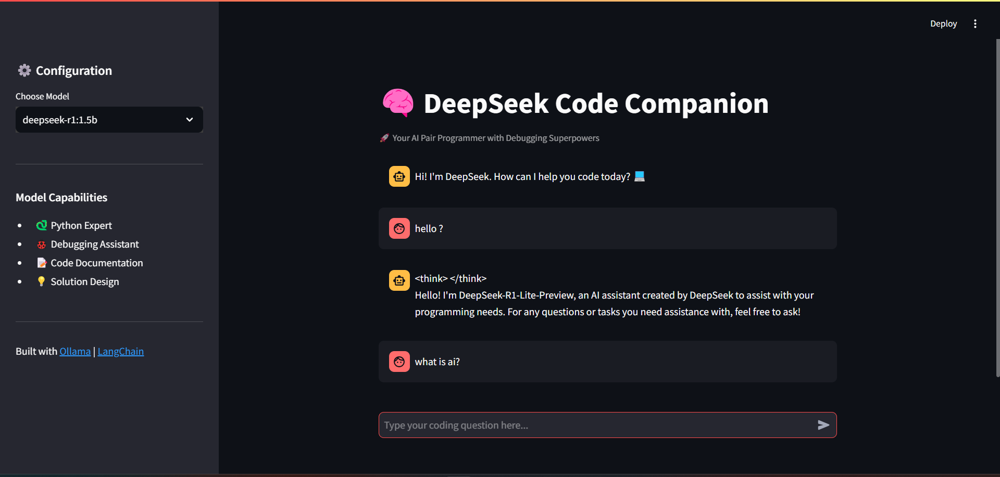

# 🧠 DeepSeek Code Companion

🚀 **Your AI-Powered Pair Programmer with Debugging Superpowers!**

DeepSeek Code Companion is an AI-driven coding assistant built with **Streamlit**, **Ollama**, and **LangChain**. It provides real-time coding assistance, debugging help, and intelligent code suggestions with a clean, interactive UI.

## 🌟 Features

- 🐍 **Python Expert** – Get instant coding assistance and solutions.
- 🐞 **Debugging Assistant** – Identify and fix errors efficiently.
- 📝 **Code Documentation** – Generate well-structured documentation.
- 💡 **Solution Design** – Receive AI-powered recommendations for coding problems.
- 🔍 **Toggle AI Thinking Process** – View or hide the model's thought process dynamically.

---

## 🛠️ Installation & Setup

Follow these steps to set up and run the project locally:

### 1️⃣ Clone the Repository
```sh
git clone https://github.com/your-username/deepseek-code-companion.git
cd deepseek-code-companion
```

### 2️⃣ Create and Activate a Virtual Environment
```sh
python -m venv venv
# Activate on Windows
venv\Scripts\activate
# Activate on macOS/Linux
source venv/bin/activate
```

### 3️⃣ Install Dependencies
```sh
pip install -r requirements.txt
```

### 4️⃣ Run the Application
```sh
streamlit run app.py
```

---

## ⚙️ Configuration

### 📌 Model Selection
The app allows users to choose between different **DeepSeek** models:
- `deepseek-r1:1.5b`
- `deepseek-r1:3b`

You can select the model from the **sidebar settings**.

### 🌐 Ollama Backend Setup
Ensure **Ollama** is running on your system:
```sh
ollama serve
```
By default, the application interacts with the **Ollama API** at `http://localhost:11434`.

---

## 🖥️ User Interface
- **Chat Interface**: Users can input coding queries, and AI provides responses.
- **Live Streaming**: AI streams responses token by token in real-time.
- **Thinking Process Toggle**: Users can choose to show/hide AI's internal processing thoughts.
- **Dark Mode UI**: Custom-designed dark theme for better readability.

---
  

## 📸 Screenshots  
| Responding Chatbot |  
|-------------------|  
|  |  

---

## 📌 Future Enhancements
- 🔄 **More Model Options**
- 🛠️ **Improved Debugging Capabilities**
- 💾 **Code Execution Support**
- 🤖 **Voice Input for Queries**

---

## 🤝 Contributing
Contributions are welcome! Feel free to fork the repo, make changes, and submit a pull request. 🚀

1. **Fork the repository**
2. **Create a new branch** (`feature-branch`)
3. **Commit your changes** (`git commit -m 'Add new feature'`)
4. **Push to the branch** (`git push origin feature-branch`)
5. **Create a Pull Request**

---

## 📜 License
This project is licensed under the **MIT License**. See the [LICENSE](LICENSE) file for details.

---

## 📩 Contact
💡 Have suggestions or need help? Reach out!
- **GitHub**: [Ganesh Agrahari](https://github.com/ganeshagrahari)
- **LinkedIn**: [Ganesh Agrahari](https://www.linkedin.com/in/ganesh-agrahari-727746263/)

🚀 *Happy Coding!*

